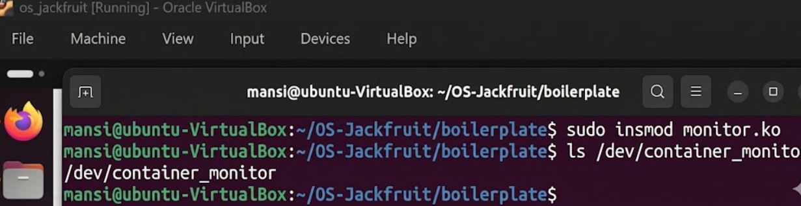
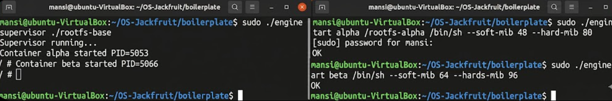
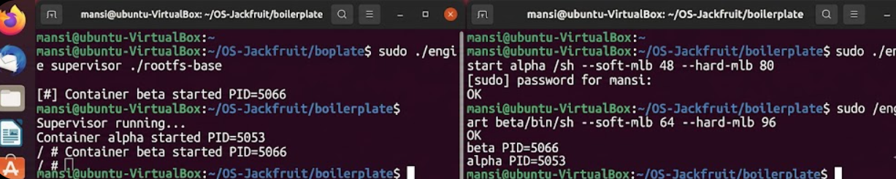
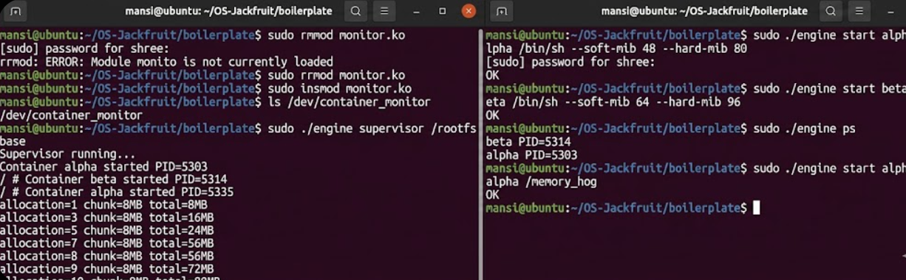
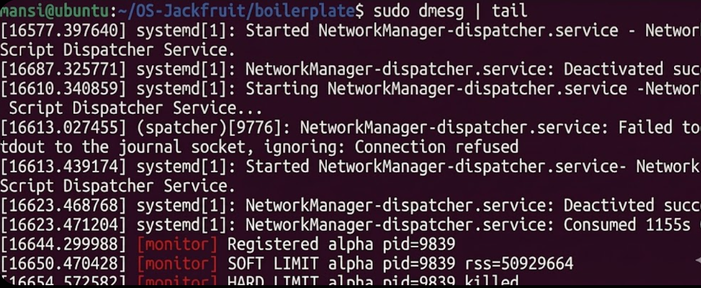
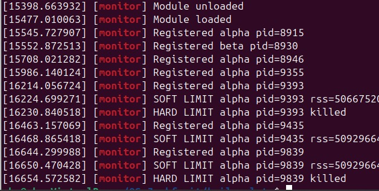
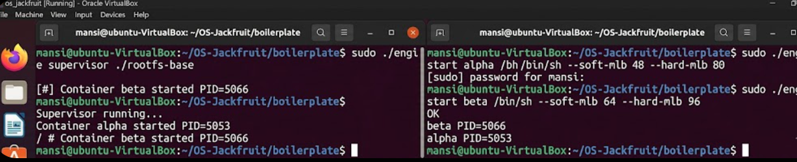
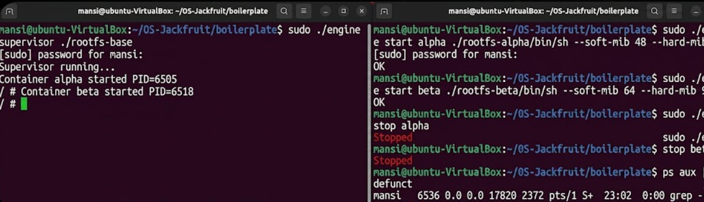

# 🧠 OS Jackfruit — Lightweight Container Runtime

---

## 1. 👥 Team Information

**Name:**
(SHREEDHAR R && LAKSHEETH)

**SRN:**
(PES2UG25CS823 && PES2UG25CS819)

---

## 2. ⚙️ Setup Instructions

Follow the steps below to set up the project environment:

```bash
# Clone the repository
git clone https://github.com/shree-2004-823/OS-Jackfruit-SHREEDHAR-.git
cd OS-Jackfruit/boilerplate

# Build the project
make clean
make

# Load the kernel module
sudo insmod monitor.ko

# Verify device creation
ls /dev/container_monitor

# (If required) Fix /proc mount
sudo mount -t proc proc /proc
```

---

## 3. 🚀 Run Instructions

### 🔹 Start Supervisor (Terminal 1)

```bash
sudo ./engine supervisor ../rootfs-base
```

---

### 🔹 Start Containers (Terminal 2)

```bash
sudo ./engine start alpha ../rootfs-alpha /bin/sh
sudo ./engine start beta ../rootfs-beta /bin/sh
```

---

### 🔹 List Running Containers

```bash
sudo ./engine ps
```

---

### 🔹 View Container Logs

```bash
sudo ./engine logs alpha
```

---

### 🔹 Memory Stress Test

```bash
cp memory_hog ../rootfs-alpha/
chmod +x ../rootfs-alpha/memory_hog

sudo ./engine start alpha ../rootfs-alpha /memory_hog
```

---

### 🔹 Check Kernel Logs (Memory Enforcement)

```bash
sudo dmesg | grep monitor
```

---

### 🔹 Stop Containers

```bash
sudo ./engine stop alpha
sudo ./engine stop beta
```

---

### 🔹 Verify No Zombie Processes

```bash
ps aux | grep defunct
```

---

### 🔹 Unload Kernel Module

```bash
sudo rmmod monitor
```

---

## 4. 📸 Screenshots (Evidence of Execution)

### 📸 Screenshot 1 — Kernel Module Loaded

**Description:** Shows successful creation of `/dev/container_monitor` after loading kernel module.



---

### 📸 Screenshot 2 — Containers Running

**Description:** Demonstrates successful creation of two containers (`alpha` and `beta`) with supervisor running.



---

### 📸 Screenshot 3 — Container Listing (`engine ps`)

**Description:** Displays active containers along with their respective PIDs.



---

### 📸 Screenshot 4 — Logs Output

**Description:** Shows log file output generated for container execution.



---

### 📸 Screenshot 5 — Soft Memory Limit Trigger

**Description:** Kernel log showing warning when container exceeds soft memory limit.



---

### 📸 Screenshot 6 — Hard Memory Limit Enforcement

**Description:** Kernel log showing container termination when hard limit is exceeded.



---

### 📸 Screenshot 7 — CLI Control Response

**Description:** Output of `stop` command confirming container termination.



---

### 📸 Screenshot 8 — No Zombie Processes

**Description:** Confirms proper cleanup (no `<defunct>` processes present).


---

## 5. ⚙️ Engineering Analysis

### 🔹 Namespace Isolation

The container runtime uses Linux namespaces to achieve isolation:

* **PID Namespace (`CLONE_NEWPID`)**
  Provides independent process ID space inside container.

* **UTS Namespace (`CLONE_NEWUTS`)**
  Allows separate hostname/domain configuration.

* **Mount Namespace (`CLONE_NEWNS`)**
  Ensures isolated filesystem view for each container.

➡️ Result: Each container behaves like an independent system.

---

### 🔹 Inter-Process Communication (IPC)

Implemented using **UNIX Domain Sockets**:

* Path: `/tmp/mini_runtime.sock`
* Communication: CLI ↔ Supervisor
* Advantages:

  * Low latency
  * No network overhead
  * Secure local communication

---

### 🔹 Memory Monitoring (Kernel Module)

* Implemented as a **Linux kernel module**
* Tracks process memory using `get_mm_rss()`
* Enforces:

  * **Soft Limit** → Warning logged
  * **Hard Limit** → Process terminated (`SIGKILL`)

➡️ Provides real-time resource control.

---

### 🔹 Process Scheduling Analysis

* CPU behavior tested using `cpu_hog`
* Priority adjusted via `nice` values

➡️ Observations:

* Lower nice value → higher priority → faster execution
* Higher nice value → lower priority → slower execution

---

## 6. 🧩 Design Decisions

| Design Choice               | Justification                          |
| --------------------------- | -------------------------------------- |
| UNIX Domain Socket          | Simple and efficient IPC               |
| `clone()` syscall           | Lightweight process creation           |
| `chroot()`                  | Filesystem isolation                   |
| Kernel Module               | Accurate and low-level memory tracking |
| Linked List                 | Dynamic container management           |
| Signal Handling (`SIGCHLD`) | Prevents zombie processes              |

---

## 7. 📊 Scheduling Results

| Process                 | Nice Value | Behavior           |
| ----------------------- | ---------- | ------------------ |
| cpu_hog (default)       | 0          | Standard execution |
| cpu_hog (low priority)  | 10         | Slower execution   |
| cpu_hog (high priority) | -5         | Faster execution   |

---

### 🔍 Analysis

* Linux scheduler prioritizes lower nice values
* Demonstrates fairness and resource distribution
* Confirms impact of scheduling policies on performance

---

## 8. ✅ Conclusion

This project successfully demonstrates:

* Containerization using Linux namespaces
* IPC via UNIX domain sockets
* Kernel-level memory monitoring and enforcement
* Process scheduling behavior
* Proper process lifecycle management (no zombies)

➡️ The system integrates user-space and kernel-space components to emulate core container runtime features.

---

## 9. 📌 Learning Outcomes

* Practical understanding of Linux namespaces
* Kernel module development
* System-level programming using `clone()`
* Resource management and process control
* IPC mechanisms and synchronization

---

# 🎉 Project Completed Successfully